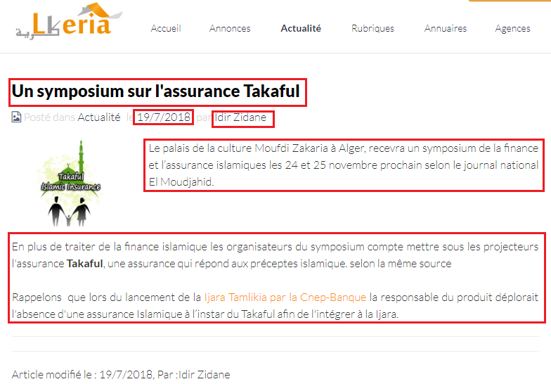
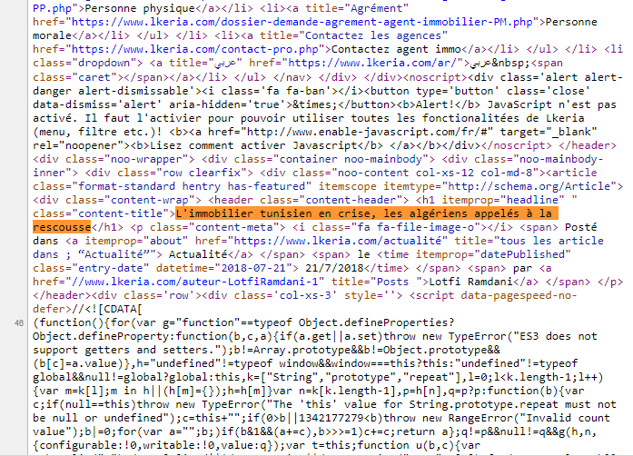
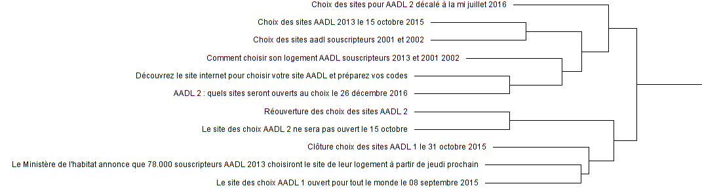
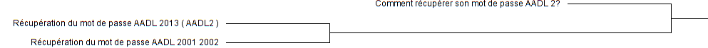

```{r  message=FALSE,warning=FALSE,cache=T}
library(tidyverse) #data manipulation and visualization
library(rvest)
library(textmineR)
library(wordcloud)
library(SentimentAnalysis)
```
## introduction:
Lkeria website contain alot of articles that we may find useful to analyse.  

With the first look in `Actualité`section we find different  articles with different topics.  

  

As we select one article, we see a page like this one bellow, contain different informations.  

  


##Part One: Getting Data
#### Scrap the data from LKERIA web site. 

This is an exemple how source code look like:  

  
  
    
Here we're going to create a function to scrap all avaible links from Lkeria page's.  

```{r message=FALSE,warning=FALSE,cache =TRUE}
Scrap_links<- function(url){
  url %>% 
    read_html()%>%
    html_nodes("a")%>%
    html_attr("href")%>%
    unique()
}
```
Since all articles Lkeria website  have  one root, wiche is:
```{r message=FALSE,warning=FALSE,cache =TRUE}
url <- "https://www.lkeria.com/actualité-P"  # The root Link.

links <- lapply(paste0(url,                  # list_apply function "Scrap_link"
                       c(1:72)),             # on all avaible "Actualité"
                Scrap_links)                 # links on Lkeria website  to return list of vectors of links
```
Let's take look at links:
```{r message=FALSE,warning=FALSE,cache =TRUE}

head(links[[1]],10)                       # print first 5 Observations
```
Since it's list of vectors of links, we need to find links with a specific pattern.

```{r message=FALSE,warning=FALSE,cache =TRUE}
#Define indices to use it later on.
indices <- lapply(X = links,               # use list_apply function on links
                  FUN = grep,              # with grep function   
                  pattern = "^actualité/") # to return all indicies of character that start with  "actualité/"

head(indices[[1]])                         # indicies of first link on first webpage
```

Now, that we have all links, and indicies needed let's wrap it up:

```{r message=FALSE,warning=FALSE,cache =TRUE}
# Function to combine list and it's indicies:

scrap_lkeria <- function(x,l,i){         # x: page range, l: list, i: indices
  return(l[[x]][i[[x]]])
  
}

Thelinks <- sapply(c(1:72),             # application simplify_apply on scrap_lkeria
                   FUN =scrap_lkeria,   # to return list of needed links.
                   USE.NAMES = F,
                   l=links,
                   i=indices)%>%
  unlist(use.names = F)                 # to transfer it from list of vectors to charachter vector.

head(Thelinks)
```
So far so good, but we still need to add strings in order to be a usefull links.

```{r message=FALSE,warning=FALSE,cache =TRUE}
#Easy Step
Thelinks <- paste0("https://www.lkeria.com/",Thelinks)

head(Thelinks)
print(paste0("Number of links: ",length(Thelinks)))

```   

Getting links it was the easy part, now let's start scraping the articles using `Thelinks`, But first of all we need to define  patterns to use in scraping and subsutting with *Regular expression*.  
- `<.*?>` To remove all HTML tags.  
- `http[^[:space:]]*` To remove all html links that start with http or https.  
- `\\(adsbygoogle=window.adsbygoogle\\|\\|\\[\\]\\).push\\(\\{\\}\\);` To remove google ads.  
- `\\[.*?\\]` in case there are tags like `[caption][/captio]` etc...  
- Also removing names of writers since there are few names mentioned bellow.   

```{r message=FALSE,warning=FALSE,cache =TRUE}
the_pattern <- paste("<.*?>",
                      "http[^[:space:]]*",
                      "\\(adsbygoogle=window.adsbygoogle\\|\\|\\[\\]\\).push\\(\\{\\}\\);",
                      "\\[.*?\\]",
                     "Idir Zidane",
                     "Izouaouen Noreddine",
                     "Lotfi Ramdani",
                     "Nabil Walid",
                     "Rédaction Lkeria",
                     "Walid Nsaibia",
                      sep = "|")
# Define scrap_articles function: 
Scrap_articles <- function(url){
      html <- url %>%                              # creat HTML page from URL input
        read_html()
      
      title <- html%>%                             # Get title from 
        html_nodes(".content-title")%>%            # .content-title node
        html_text()%>%                             # transform from html to text
        iconv(from = "UTF-8","latin1", sub="")%>%  # remove all character that's not latin1
        str_trim()                                 # remove leading and trailing white spaces
      
      raw_info <- html%>%                          # Get all avaible text from 
        html_nodes(".content-meta")%>%             # .content-meta node
        html_text()%>%                             # transform from html to text
        str_split(pattern = "le|par")              # split to a list based on pattern to define date/writer
      
      date <- raw_info[[1]][2] %>%                 # get date
                          str_trim()               # remove leading and trailing white spaces
      
      writer <- raw_info[[1]][3] %>%               # get writer name's
                    str_trim()                     # remove leading and trailing white spaces
      
      intro  <- html%>%                            # get introduction section from
        html_nodes(".col-xs-9")%>%                 # .col-xs-9 node
        html_text()%>%                             # transform from html to text
        str_replace_all(pattern =the_pattern ,     # remove unwanted pattern and
                        replacement = " ")%>%      # replace with white space
        iconv(from = "UTF-8","latin1", sub="")%>%  # remove all character that's not latin1
        str_trim()                                 # remove leading and trailing white spaces
      
      
      
      if((length(intro) == 0) ||                     # Check in case intro is Empty          
         ( str_detect(intro,"Article modifié le") || # Check in case intro is the same as Text(further var)
           nchar(intro)<=1)){                        # Check in case intro is only white space
        intro <- NA                                  # Force intro to be NA
      }
      
      text <- (html%>%                                            
        html_nodes(".content")%>%                    # Select node .content from HTML page
        html_text() %>%                              # get the text
        str_split(pattern = "Article modifié le"))[[1]][1] %>% # Split based on patter retrive text 
        str_replace_all(pattern = the_pattern,replacement = " ")%>% # remove unwated pattern
        iconv(from = "UTF-8","latin1", sub="")%>%    # remove all character that's not latin1
        str_trim()                                   # remove leading and trailing white spaces
      
      return(c(title,date,writer,intro,text,url))    # retun all retrieved var
}

secure_scrap <- possibly(.f = Scrap_articles,             # Creat secure funtion to return NAs 
                        otherwise = c(NA,NA,NA,NA,NA,NA),# in case there is dead links
                        quiet = T)                       # skip warnings or msg.
```
After defining the function needed, let's start the process to scrap the data:
```{r message=FALSE,warning=FALSE,cache =TRUE}
start.time <- Sys.time()                                    # Start time excution

DF <- Thelinks %>% 
  map(.f = secure_scrap) %>%                                # map var Thelinks as input to scure_scrap
  map(function(x) data.frame(t(x),stringsAsFactors = F))%>% # map list output from previous map to creat  DFs 
  bind_rows()                                               # tansform list of Data frames to one DF

names(DF) <- c("Title",                                     # Define column names
               "Publication.Date",
               "Writer",
               "Introduction",
               "Text",
               "Link")

end.time <- Sys.time()                                     # Stop time excution

time.taken <- end.time - start.time                        # difference

print(time.taken)            
```

```{r message=FALSE,warning=FALSE,cache =TRUE}
glimpse(DF) 

write.csv(x = DF,                  # Define var to store
          file = "ScapedFile.csv", # file name
          row.names = F)           # drop raw names
```

## Part Two: Data Cleaning & Manipulation  

From the previous section we've got a complete data set of articles, but still has some NA's, and uncleaned data. 

```{r message=FALSE,warning=FALSE,cache =TRUE}
DF <- read.csv("ScapedFile.csv",               # Since it's small datasets we can use base function
               encoding = "latin1",            # "latin1" to be able to read charachters with "accents"
               stringsAsFactors = F)           # Drop factors Option

glimpse(DF)                                    # take a glimpse
``` 
  
Now, we need to some manipulation and  cleaning:    

* Transform `Publication.Date` to Date format to be useful.  

* Remove rows with NA values in `Publication.Date` var.  

* Creat a variable that take `Intro` if `Text` == NA else take `Text`.  

* Extract New variable `Type` from `Link` using *regular expression*.  


```{r message=FALSE,warning=FALSE,cache =TRUE}
DF$Publication.Date <- DF$Publication.Date %>%      # Transform Publication.Date from
                        as.Date(format="%d/%m/%Y")  # Character to date type


DF <- DF[!is.na(DF$Publication.Date),]              # Select only rows that doesn't contain NA's

DF$Full.Text <- DF$Text                             # Creat Full.text Var similair to Text var

DF$Full.Text[is.na(DF$Full.Text)] <- DF$Introduction[is.na(DF$Full.Text)] # fill NA's Var.

DF$Full.Text<- DF$Full.Text %>%                   # Remove residue of HTML code
  str_replace_all("\\{[^\\}]+\\}|\\.[A-Za-z0-9_]+|#[#A-Za-z0-9_]+|\\W", " ")

sum(is.na(DF$Full.Text))                            # Check if there are NA's in Full.text var
  
DF$Type <- sapply(DF$Link,                          # Created new var Type from Link
                      FUN = function(x) strsplit(x,split = "/")[[1]][5], # custum function to select
                      USE.NAMES = F)                # remove row names.                        


DF <- DF %>%                                        # We removed Intro, Text, Link
  select(Title,Publication.Date,Writer,Full.Text,Type)


glimpse(DF)                                         # take glimpse

table(DF$Type)                                      # Count Different Obs in Type var

write.csv(DF,"CleanedArticles.csv",row.names = F)      # always save your progress

Col_class <- sapply(DF,class,USE.NAMES = F)
```   

## Part Three: Text Mining


```{r message=FALSE,warning=FALSE,cache =TRUE}
DF <- read.csv("CleanedArticles.csv",                  # Read CSV file with "Latin1" Encoding
               encoding = "latin1",                    # also we specified the class of each Column
               colClasses = c("character","Date",rep("character",3)),# using attr colClasses
               stringsAsFactors=F)                     # and set StringsAsFactors to False
                
glimpse(DF)                                            # take a glimpse to see
```

Before starting let's how many articles do we have over time.  

```{r message=FALSE,warning=FALSE,cache =TRUE}

DF <- DF %>%
  mutate(Year = as.integer(format(Publication.Date,"%Y")),      #Creat new Variable Year
         n_char = nchar(Full.Text))                             # Creat new variabl character length

ggplot(DF, aes(Year))+
  geom_bar(aes(fill = Type), position = position_stack(reverse = TRUE)) +
  coord_flip() +
  theme(legend.position = "top")+
  xlab( "Years" ) +
  ylab( "Articles Frequency" )

```  

As we can see that Lkeria start make classification for articles only after year 2014.

What about the lentgh of documents?  

```{r message=FALSE,warning=FALSE,cache =TRUE}

ggplot(DF, aes(x=n_char))+
  geom_density(color="darkblue", fill="lightblue") +
  theme(axis.text.y = element_blank(),
  axis.ticks = element_blank(),
  axis.text.x = element_text(angle = 90, hjust = 1))+
  scale_x_continuous(breaks = round(seq(0, max(DF$n_char), by = 1000),1))
```  


Not let's focuse on more important things, Documents clustering.  
Since we're going to study only subject "Housing", so we're going to select only articles of types:  

* `AADL` & `LPA`  (both have almost same characteristics)  
  
* `LPP`  

```{r message=FALSE,warning=FALSE,cache =TRUE}
AADL_LPA <- DF %>%                                      
  filter(Type %in% c("aadl","lpa"))%>%                  # Select AADL, LPA TYPE
  select(Title,Publication.Date,Writer,Type,Full.Text)  # Select the wanted columns

LPP <- DF %>%
  filter(Type == "lpp")%>%                              # Select AADL, LPP TYPE
  select(Title,Publication.Date,Writer,Full.Text)       # Select the wanted columns

glimpse(AADL_LPA)
``` 
Before starting clustering and messing up things, let's see the definition.  

* `Tf-idf` stands for term frequency-inverse document frequency, and the tf-idf weight is a weight often used in information retrieval and text mining. This weight is a statistical measure used to evaluate how important a word is to a document in a collection or corpus. The importance increases proportionally to the number of times a word appears in the document but is offset by the frequency of the word in the corpus. Variations of the `tf-idf` weighting scheme are often used by search engines as a central tool in scoring and ranking a document's relevance given a user query. more [here](http://www.tfidf.com/).  

  
** TF: Term Frequency: which measures how frequently a term occurs in a document. Since every document is different in length, it is possible that a term would appear much more times in long documents than shorter ones. Thus, the term frequency is often divided by the document length (aka. the total number of terms in the document) as a way of normalization: 

TF(t) = (Number of times term t appears in a document) / (Total number of terms in the document).  

  
  
** IDF: Inverse Document Frequency, which measures how important a term is. While computing TF, all terms are considered equally important. However it is known that certain terms, such as "is", "of", and "that", may appear a lot of times but have little importance. Thus we need to weigh down the frequent terms while scale up the rare ones, by computing the following: 

IDF(t) = log_e(Total number of documents / Number of documents with term t in it).


* `Hierarchical Clustering` :  

`Hierarchical Clustering` involves creating clusters that have a predetermined ordering from top to bottom. For example, all files and folders on the hard disk are organized in a hierarchy. There are two types of hierarchical clustering, `Divisive` and `Agglomerative`.  
  

  
* `Divisive` method	:	
In divisive or top-down clustering method we assign all of the observations to a single cluster and then partition the cluster to two least similar clusters. Finally, we proceed recursively on each cluster until there is one cluster for each observation. There is evidence that divisive algorithms produce more accurate hierarchies than agglomerative  algorithms in some circumstances but is conceptually more complex.		
 		
* `Agglomerative` method:  
In `Agglomerative` or bottom-up clustering method we assign each observation to its own cluster. Then, compute the similarity (e.g., distance) between each of the clusters and join the two most similar clusters. Finally, repeat steps 2 and 3 until there is only a single cluster left. The related algorithm is shown below.  


```{r message=FALSE,warning=FALSE,cache =TRUE}
AADL_LPA$Title[AADL_LPA$Title==""] <- NA         # replace one character string with NA for AADL_LPA

AADL_LPA <- AADL_LPA[!is.na(AADL_LPA$Title),]    # remove those lines

LPP$Full.Text[LPP$Full.Text==""] <- NA           # replace one character string with NA for LPP

LPP <- LPP[!is.na(LPP$Full.Text),]               # remove those line

dtm <- CreateDtm(doc_vec = (AADL_LPA$Full.Text), # character vector of documents
                 doc_names = AADL_LPA$Title,     # document names
                 ngram_window = c(1, 2),         # minimum and maximum n-gram length
                 stopword_vec = c(tm::stopwords("french"), # stopwords from tm
                                  tm::stopwords("SMART")), # this is the default value
                 lower = TRUE,                   # lowercase - this is the default value
                 remove_punctuation = TRUE,      # punctuation - this is the default
                 remove_numbers = TRUE,          # numbers - this is the default
                 verbose = FALSE)


# construct the matrix of term counts to get the IDF vector
tf_mat <- TermDocFreq(dtm)

# TF-IDF and cosine similarity
tfidf <- t(dtm[ , tf_mat$term ]) * tf_mat$idf

tfidf <- t(tfidf)                              # Transpose

csim <- tfidf / sqrt(rowSums(tfidf * tfidf))   # cosine similarity

csim <- csim %*% t(csim)

cdist <- as.dist(1 - csim)                     # Clalculate distances

hc <- hclust(cdist, method = "ward.D")         

clustering <- cutree(hc, 10)

png("cluster_total.png",width = 4096,height = 2160)

plot(hc, main = "Hierarchical clustering of  AADL & LPA Articles",
     ylab = "", xlab = "", yaxt = "n")

rect.hclust(hc, 10, border = "red")

dev.off()

```    

Now Let's see what clustering gives us:  

Cluster One :  

  
  
    
    
#### As you can see, you can notioce that in indeed there is similarity in theses articles, what about other clusters.   
  
Cluster Three:  

  
  
    
    
Oh, That's Obvious, You can check the rest of the cluster later on.  


```{r message=FALSE,warning=FALSE,cache =TRUE}

p_words <- colSums(dtm) / sum(dtm)

cluster_words <- lapply(unique(clustering), function(x){
  rows <- dtm[ clustering == x , ]
  
  # for memory's sake, drop all words that don't appear in the cluster
  rows <- rows[ , colSums(rows) > 0 ]
  
  colSums(rows) / sum(rows) - p_words[ colnames(rows) ]
})


# create a summary table of the top 5 words defining each cluster
cluster_summary <- data.frame(cluster = unique(clustering),
                              size = as.numeric(table(clustering)),
                              top_words = sapply(cluster_words, function(d){
                                paste(
                                  names(d)[ order(d, decreasing = TRUE) ][ 1:5 ], 
                                  collapse = ", ")
                              }),
                              stringsAsFactors = FALSE)
cluster_summary

pal <- brewer.pal(8,"Dark2")
# plot a word cloud of one cluster as an example
wordcloud::wordcloud(words = names(cluster_words[[ 5 ]]), 
                     freq = cluster_words[[ 5 ]], 
                     max.words = 400, 
                     random.order = FALSE,
                     color = pal,
                     main = "Top words in cluster 400")

```


### Sentiment analysis:  


```{r message=FALSE,warning=FALSE,cache =TRUE}

to_remove <- paste(paste0(tm::stopwords(kind="fr"),collapse =  " | "),
                   "[[:punct:]]",
                   "da",
                   "dinars",
                   "\\d+",
                   sep="|")

DF <- DF[DF$Full.Text != "",]

DF$Full.Text<- DF$Full.Text %>%
  tolower()%>%
  str_replace_all(to_remove, " ")
  

costum_sentiment <- function(x){
 
  analyzeSentiment(x,
                   language="french",
                   rules=list("SentimentLM"=list(ruleSentiment, loadDictionaryGI())))

}

DF$Sentiment <- DF$Full.Text %>% 
  sapply(FUN= costum_sentiment,USE.NAMES = F)%>%
  unlist(use.names = F)

glimpse(DF)
```  

```{r message=FALSE,warning=FALSE,cache =TRUE}
DF %>%
  select(Publication.Date,Title,Sentiment)%>%
  head()

```  
  
  
```{r message=FALSE,warning=FALSE,cache =TRUE}
AADL_LPA <- DF %>%                                      
  filter(Type %in% c("aadl","lpa"))%>%                        # Select AADL, LPA TYPE
  select(Title,Publication.Date,Writer,Type,Full.Text,Sentiment)  # Select the wanted columns

LPP <- DF %>%
  filter(Type == "lpp")%>%                                        # Select AADL, LPP TYPE
  select(Title,Publication.Date,Writer,Full.Text,Sentiment)       # Select the wanted columns


ggplot(data = AADL_LPA,aes(x = Publication.Date,y = Sentiment,color=Type))+ # Plot1 for AADL_LPA
geom_point()+
geom_smooth(method='lm',formula=y~x,se = F)
  
ggplot(data = LPP,aes(x = Publication.Date,y = Sentiment))+               # Plot1 for LPP
geom_point()+
geom_smooth(method='lm',formula=y~x,se = F)


```  

