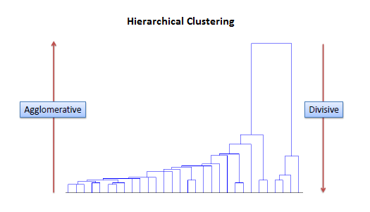

We need to relaod the libraries and the data:

```{r message=FALSE,warning=FALSE,cache =TRUE}

library(tidyverse) #data manipulation and visualization
library(textmineR)
library(wordcloud)
library(SentimentAnalysis)

DF <- read.csv("CleanedArticles.csv",                  # Read CSV file with "Latin1" Encoding
               encoding = "latin1",                    # also we specified the class of each Column
               colClasses = c("character","Date",rep("character",3)),# using attr colClasses
               stringsAsFactors=F)                     # and set StringsAsFactors to False
                
glimpse(DF)                                            # take a glimpse to see
```

Before starting let's how many articles do we have over time.  

```{r message=FALSE,warning=FALSE,cache =TRUE}

DF <- DF %>%
  mutate(Year = as.integer(format(Publication.Date,"%Y")),      #Creat new Variable Year
         n_char = nchar(Full.Text))                             # Creat new variabl character length

ggplot(DF, aes(Year))+
  geom_bar(aes(fill = Type), position = position_stack(reverse = TRUE)) +
  coord_flip() +
  theme(legend.position = "top")+
  xlab( "Years" ) +
  ylab( "Articles Frequency" )

```  

As we can see that Lkeria start make classification for articles only after year 2014.

What about the lentgh of documents?  

```{r message=FALSE,warning=FALSE,cache =TRUE}

ggplot(DF, aes(x=n_char))+
  geom_density(color="darkblue", fill="lightblue") +
  theme(axis.text.y = element_blank(),
  axis.ticks = element_blank(),
  axis.text.x = element_text(angle = 90, hjust = 1))+
  scale_x_continuous(breaks = round(seq(0, max(DF$n_char), by = 1000),1))
```  


Not let's focuse on more important things, Documents clustering.  
Since we're going to study only subject "Housing", so we're going to select only articles of types:  

* `AADL` & `LPA`  (both have almost same characteristics)  
  
* `LPP`  

```{r message=FALSE,warning=FALSE,cache =TRUE}
AADL_LPA <- DF %>%                                      
  filter(Type %in% c("aadl","lpa"))%>%                  # Select AADL, LPA TYPE
  select(Title,Publication.Date,Writer,Type,Full.Text)  # Select the wanted columns

LPP <- DF %>%
  filter(Type == "lpp")%>%                              # Select AADL, LPP TYPE
  select(Title,Publication.Date,Writer,Full.Text)       # Select the wanted columns

glimpse(AADL_LPA)
``` 
Before starting clustering and messing up things, let's see the definition.  

* `Clustering` :  

`Hierarchical Clustering` involves creating clusters that have a predetermined ordering from top to bottom. For example, all files and folders on the hard disk are organized in a hierarchy. There are two types of hierarchical clustering, `Divisive` and `Agglomerative`.  

 

  
* `Divisive` method	:	
In divisive or top-down clustering method we assign all of the observations to a single cluster and then partition the cluster to two least similar clusters. Finally, we proceed recursively on each cluster until there is one cluster for each observation. There is evidence that divisive algorithms produce more accurate hierarchies than agglomerative  algorithms in some circumstances but is conceptually more complex.		
 		
* `Agglomerative` method:  
In `Agglomerative` or bottom-up clustering method we assign each observation to its own cluster. Then, compute the similarity (e.g., distance) between each of the clusters and join the two most similar clusters. Finally, repeat steps 2 and 3 until there is only a single cluster left. The related algorithm is shown below.  
  
  
* `Tf-idf` stands for term frequency-inverse document frequency, and the tf-idf weight is a weight often used in information retrieval and text mining. This weight is a statistical measure used to evaluate how important a word is to a document in a collection or corpus. The importance increases proportionally to the number of times a word appears in the document but is offset by the frequency of the word in the corpus. Variations of the `tf-idf` weighting scheme are often used by search engines as a central tool in scoring and ranking a document's relevance given a user query. more [here](http://www.tfidf.com/).  

  
    + `TF`: Term Frequency: which measures how frequently a term occurs in a document. Since every document is different in length, it is possible that a term would appear much more times in long documents than shorter ones. Thus, the term frequency is often divided by the document length (aka. the total number of terms in the document) as a way of normalization:   
    
        TF(t) = (Number of times term t appears in a document) / (Total number of terms in the document).  

  
  
    + `IDF`: Inverse Document Frequency, which measures how important a term is. While computing TF, all terms are considered equally important. However it is known that certain terms, such as "is", "of", and "that", may appear a lot of times but have little importance. Thus we need to weigh down the frequent terms while scale up the rare ones, by computing the following:  
    
    
        IDF(t) = log_e(Total number of documents / Number of documents with term t in it).
  
```{r message=FALSE,warning=FALSE,cache =TRUE}
AADL_LPA$Title[AADL_LPA$Title==""] <- NA         # replace one character string with NA for AADL_LPA

AADL_LPA <- AADL_LPA[!is.na(AADL_LPA$Title),]    # remove those lines

LPP$Full.Text[LPP$Full.Text==""] <- NA           # replace one character string with NA for LPP

LPP <- LPP[!is.na(LPP$Full.Text),]               # remove those line

dtm <- CreateDtm(doc_vec = (AADL_LPA$Full.Text), # character vector of documents
                 doc_names = AADL_LPA$Title,     # document names
                 ngram_window = c(1, 2),         # minimum and maximum n-gram length
                 stopword_vec = c(tm::stopwords("french"), # stopwords from tm
                                  tm::stopwords("SMART")), # this is the default value
                 lower = TRUE,                   # lowercase - this is the default value
                 remove_punctuation = TRUE,      # punctuation - this is the default
                 remove_numbers = TRUE,          # numbers - this is the default
                 verbose = FALSE)


# construct the matrix of term counts to get the IDF vector
tf_mat <- TermDocFreq(dtm)

# TF-IDF and cosine similarity
tfidf <- t(dtm[ , tf_mat$term ]) * tf_mat$idf

tfidf <- t(tfidf)                              # Transpose

csim <- tfidf / sqrt(rowSums(tfidf * tfidf))   # cosine similarity

csim <- csim %*% t(csim)

cdist <- as.dist(1 - csim)                     # Clalculate distances

hc <- hclust(cdist, method = "ward.D")         

clustering <- cutree(hc, 10)

png("cluster_total.png",width = 4096,height = 2160)

plot(hc, main = "Hierarchical clustering of  AADL & LPA Articles",
     ylab = "", xlab = "", yaxt = "n")

rect.hclust(hc, 10, border = "red")

dev.off()

```    

Now Let's see what clustering gives us:  


```{r message=FALSE,warning=FALSE,cache =TRUE}

p_words <- colSums(dtm) / sum(dtm)

cluster_words <- lapply(unique(clustering), function(x){
  rows <- dtm[ clustering == x , ]
  
  # for memory's sake, drop all words that don't appear in the cluster
  rows <- rows[ , colSums(rows) > 0 ]
  
  colSums(rows) / sum(rows) - p_words[ colnames(rows) ]
})


# create a summary table of the top 5 words defining each cluster
cluster_summary <- data.frame(cluster = unique(clustering),
                              size = as.numeric(table(clustering)),
                              top_words = sapply(cluster_words, function(d){
                                paste(
                                  names(d)[ order(d, decreasing = TRUE) ][ 1:5 ], 
                                  collapse = ", ")
                              }),
                              stringsAsFactors = FALSE)
cluster_summary


```


```{r cache=TRUE}
dd <- data.frame(clustering)

dd$titles <- row.names(dd)

row.names(dd) <- NULL
names(dd) <- c("Cluster","title")


```


# {.tabset}

## Cluster 1
```{r cache=TRUE,echo=FALSE}

head(dd[dd$Cluster==1,]$title)
```

## Cluster 2
```{r cache=TRUE,echo=FALSE}

head(dd[dd$Cluster==2,]$title)
```
## Cluster 3
```{r cache=TRUE,echo=FALSE}

head(dd[dd$Cluster==3,]$title)
```


## Cluster 4
```{r cache=TRUE,echo=FALSE}

head(dd[dd$Cluster==4,]$title)
```

## Cluster 5
```{r cache=TRUE,echo=FALSE}

head(dd[dd$Cluster==5,]$title)
```
## Cluster 6
```{r cache=TRUE,echo=FALSE}

head(dd[dd$Cluster==6,]$title)
```


## Cluster 7
```{r cache=TRUE,echo=FALSE}

head(dd[dd$Cluster==7,]$title)
```

## Cluster 8
```{r cache=TRUE,echo=FALSE}

head(dd[dd$Cluster==8,]$title)
```
## Cluster 9
```{r cache=TRUE,echo=FALSE}

head(dd[dd$Cluster==9,]$title)
```
## Cluster 10
```{r cache=TRUE,echo=FALSE}

head(dd[dd$Cluster==10,]$title)
```
# 

So after reading the top 5 titles of each cluster, we see that we will keep only clusters: 3, 6, 7, 10.  


```{r message=FALSE,warning=FALSE,cache =TRUE}

AADL_LPA$cluster <- dd$Cluster

Selected <- AADL_LPA[AADL_LPA$cluster %in% c(3,6,7,10),]


to_remove <- paste(paste0(tm::stopwords(kind="fr"),collapse =  " | "),
                   "[[:punct:]]",
                   "da",
                   "dinars",
                   "\\d+",
                   sep="|")

Selected <- Selected[Selected$Full.Text != "",]

Selected$Full.Text<- Selected$Full.Text %>%
  tolower()%>%
  str_replace_all(to_remove, " ")
  

costum_sentiment <- function(x){
 
  analyzeSentiment(x,
                   language="french",
                   rules=list("SentimentLM"=list(ruleSentiment, loadDictionaryGI())))

}

Selected$Sentiment <- Selected$Full.Text %>% 
  sapply(FUN= costum_sentiment,USE.NAMES = F)%>%
  unlist(use.names = F)

glimpse(Selected)
```    


```{r message=FALSE,warning=FALSE,cache =TRUE}
Selected %>%
  select(Publication.Date,Title,Sentiment)%>%
  head()

```  


```{r message=FALSE,warning=FALSE,cache =TRUE}


ggplot(data = Selected,aes(x = Publication.Date,y = Sentiment,color=Type))+ # Plot1 for AADL_LPA
geom_point()+
geom_smooth(method='lm', formula = y ~ x + I(x^4),se = F)


```  